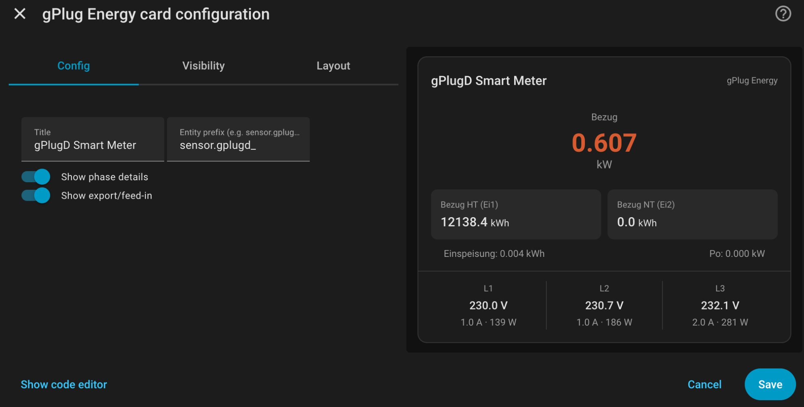

# gPlug Energy – Home Assistant Integration (HACS)

[](https://hacs.xyz)
[](https://github.com/FX6W9WZK/ha-gPlug-energy/actions)
[](https://github.com/FX6W9WZK/ha-gPlug-energy/releases)
[](https://github.com/FX6W9WZK/ha-gPlug-energy/blob/main/LICENSE)
[](https://claude.ai)

> Vollwertige Home Assistant Integration für alle [gPlug](https://gplug.ch/) Smart-Meter-Sensoren (gPlugD, gPlugD-E, gPlugK, gPlugM) mit direkter Anbindung an das Energy Dashboard.

---

## Auf einen Blick

| | |
|---|---|
| **Verbindung** | MQTT (empfohlen) oder HTTP-Polling |
| **Sensoren** | Auto-Discovery – kein YAML nötig |
| **Energy Dashboard** | Sensoren werden automatisch eingetragen |
| **Lovelace-Karte** | Registriert sich selbst – erscheint im Karten-Picker |
| **Tarife** | Doppeltarif HT/NT (z.B. EWZ Zürich) |
| **Phasen** | 3-Phasen: Spannung, Strom, Leistung (L1/L2/L3) |
| **gPlug Produkte** | gPlugD, gPlugD-E, gPlugK, gPlugM (alle unterstützt) |
| **Sprachen** | DE / FR / EN / IT |

---

## Kompatible gPlug Produkte

Die Integration unterstützt **alle aktuellen gPlug Produkte**. Das Gerätemodell wird automatisch aus dem MQTT-Topic erkannt.

| Produkt | Smart Meter | Schnittstelle | Anbindung |
|---------|------------|---------------|-----------|
| **[gPlugD](https://gplug.ch/produkte/gplugd/)** | Elster AS3000, Ensor eRS801, L&G E360, Sagemcom XT211, ISKRA AM550, NES Gen-5, M+C Flexy | P1-DSMR (RJ12) | WiFi 2.4 GHz |
| **[gPlugD-E](https://gplug.ch/produkte/gplugd-e/)** | Gleich wie gPlugD | P1-DSMR (RJ12) | Ethernet + WiFi |
| **[gPlugK](https://gplug.ch/produkte/gplugk/)** | Kamstrup Omnipower | Kamstrup HAN | WiFi 2.4 GHz |
| **[gPlugM](https://gplug.ch/produkte/gplugm/)** | L+G E450 | M-Bus (RJ12) | WiFi 2.4 GHz |

Alle Produkte verwenden die Firmware **Tasmota** und publizieren Sensordaten im gleichen JSON-Format via **MQTT**. Die Integration erkennt automatisch alle Sensor-Keys – unabhängig davon welches gPlug Modell verwendet wird.

---

## Vorschau



Die Lovelace-Karte zeigt Echtzeit-Bezug/Einspeisung, HT/NT-Zählerstände und 3-Phasen-Details. Registriert sich automatisch – kein manuelles Einrichten nötig.

---

## Installation

### HACS (empfohlen)

1. **HACS** öffnen → **⋮** (oben rechts) → **Benutzerdefinierte Repositories**
2. URL: `https://github.com/FX6W9WZK/ha-gPlug-energy` · Kategorie: **Integration**
3. **gPlug Energy** suchen → **Herunterladen**
4. Home Assistant **neu starten**

### Manuell

Ordner `custom_components/gplug_energy/` nach `<config>/custom_components/` kopieren und HA neu starten.

---

## Einrichtung

### Voraussetzung

Der gPlug (egal welches Modell) muss per MQTT mit einem Broker verbunden sein (z.B. Mosquitto). Konfiguration über die gPlug Web-UI: **Einstellungen → MQTT**.

### Integration hinzufügen

1. **Einstellungen → Geräte & Dienste → Integration hinzufügen**
2. Nach **gPlug Energy** suchen
3. **MQTT** wählen → MQTT-Topic eingeben (z.B. `tele/gPlugD_598E64/SENSOR`)
4. Fertig – Sensoren erscheinen automatisch innerhalb weniger Sekunden

Das Topic findest du in der gPlug Web-UI unter **Information** oder im MQTT Explorer.

---

## Energy Dashboard

Die Integration konfiguriert das Energy Dashboard **automatisch** 30 Sekunden nach dem Start. Falls du es manuell einrichten willst:

### Netzanschluss konfigurieren

**Einstellungen → Dashboards → Energie → Stromnetz → Netzanschluss konfigurieren**

#### Doppeltarif (HT/NT) – z.B. EWZ Zürich

Viele Schweizer VNB verwenden Hoch- und Niedertarif. Füge **beide Tarife separat** hinzu:

1. **Verbrauch hinzufügen** → `sensor.gplugd_energy_import_tariff_1` (Hochtarif)
2. **Verbrauch hinzufügen** → `sensor.gplugd_energy_import_tariff_2` (Niedertarif)
3. Optional pro Tarif: **Festen Preis verwenden** → HT z.B. 0.27 CHF/kWh, NT z.B. 0.21 CHF/kWh

Analog für die **Einspeisung** (PV-Anlage):

1. `sensor.gplugd_energy_export_tariff_1` (Einspeisung HT)
2. `sensor.gplugd_energy_export_tariff_2` (Einspeisung NT)

#### Einzeltarif

Falls dein VNB nur einen Tarif hat, reicht `sensor.gplugd_energy_import_tariff_1`.

#### Leistungsmessung

Bei der Art der Leistungsmessung **nichts auswählen**. Das Energy Dashboard rechnet aus den kWh-Zählern, nicht aus den kW-Momentanwerten.

### Sensor-Zuordnung

```
Energy Dashboard (kWh, kumulativ, total_increasing)
├── Bezug HT:        sensor.gplugd_energy_import_tariff_1  (Ei1)
├── Bezug NT:        sensor.gplugd_energy_import_tariff_2  (Ei2)
├── Einspeisung HT:  sensor.gplugd_energy_export_tariff_1  (Eo1)
└── Einspeisung NT:  sensor.gplugd_energy_export_tariff_2  (Eo2)

Live-Dashboard / Lovelace (Momentanwerte)
├── Bezugsleistung:  sensor.gplugd_power_import            (Pi, kW)
├── Einspeiseleist.: sensor.gplugd_power_export            (Po, kW)
├── Leistung L1-L3:  sensor.gplugd_power_import_l1/l2/l3  (P1i/P2i/P3i, W)
├── Spannung L1-L3:  sensor.gplugd_voltage_l1/l2/l3       (V1/V2/V3, V)
└── Strom L1-L3:     sensor.gplugd_current_l1/l2/l3       (I1/I2/I3, A)
```

---

## Lovelace-Karte

Die Karte `gplug-energy-card` wird **automatisch registriert** und erscheint im Karten-Picker.

**Dashboard bearbeiten → Karte hinzufügen → „gPlug Energy" suchen**

Oder manuell als YAML:

```yaml
type: custom:gplug-energy-card
title: gPlug Smart Meter
entity_prefix: sensor.gplugd_
show_phases: true
show_export: true
```

Die Karte zeigt Echtzeit-Power-Flow (farbcodiert: orange = Bezug, grün = Einspeisung), HT/NT-Zählerstände und 3-Phasen-Details.

---

## Unterstützte Sensoren

| Sensor | OBIS | Key | Einheit | Dashboard |
|--------|------|-----|---------|:---------:|
| Energiebezug Tarif 1 (HT) | 1.8.1 | Ei1 | kWh | ✅ Energy |
| Energiebezug Tarif 2 (NT) | 1.8.2 | Ei2 | kWh | ✅ Energy |
| Energiebezug Gesamt | 1.8.0 | Ei | kWh | ✅ Energy |
| Energieeinspeisung Tarif 1 | 2.8.1 | Eo1 | kWh | ✅ Energy |
| Energieeinspeisung Tarif 2 | 2.8.2 | Eo2 | kWh | ✅ Energy |
| Energieeinspeisung Gesamt | 2.8.0 | Eo | kWh | ✅ Energy |
| Bezugsleistung | 1.7.0 | Pi | kW | ⚡ Live |
| Einspeiseleistung | 2.7.0 | Po | kW | ⚡ Live |
| Bezugsleistung L1/L2/L3 | – | P1i/P2i/P3i | W | ⚡ Live |
| Einspeiseleistung L1/L2/L3 | – | P1o/P2o/P3o | W | ⚡ Live |
| Spannung L1/L2/L3 | 32.7/52.7/72.7 | V1/V2/V3 | V | 📊 Live |
| Strom L1/L2/L3 | 31.7/51.7/71.7 | I1/I2/I3 | A | 📊 Live |

Unbekannte Keys aus dem MQTT-Payload werden automatisch als generische Sensoren angelegt.

---

## MQTT-Payload-Formate

Die Integration erkennt verschiedene JSON-Strukturen aus gPlug Tasmota-Scripts:

**gPlug standard** (Prefix `z`):
```json
{"Time":"...","z":{"Pi":0.443,"Ei1":12131.545,"V1":230.6,...}}
```

**P1-DSMR (ASCII)**:
```json
{"Time":"...","ENERGY":{"Ei_1.8":1234.56,"Pi_1.7":0.450,...}}
```

**HDLC/DLMS** (ISKRA, M+C):
```json
{"Time":"...","ENERGY":{"Total_in":1234.56,"Power_in":0.450,...}}
```

Alle Prefixes `z`, `ENERGY`, `SML`, `P1`, `HDLC`, `DSMR` werden unterstützt.

---

## Utility Meter (optional)

Für Tages-/Monats-/Jahresauswertungen in `configuration.yaml`:

```yaml
utility_meter:
  # Bezug Hochtarif (HT)
  strom_bezug_ht_tag:
    source: sensor.gplugd_energy_import_tariff_1
    cycle: daily
  strom_bezug_ht_monat:
    source: sensor.gplugd_energy_import_tariff_1
    cycle: monthly
  strom_bezug_ht_jahr:
    source: sensor.gplugd_energy_import_tariff_1
    cycle: yearly
  # Bezug Niedertarif (NT)
  strom_bezug_nt_tag:
    source: sensor.gplugd_energy_import_tariff_2
    cycle: daily
  strom_bezug_nt_monat:
    source: sensor.gplugd_energy_import_tariff_2
    cycle: monthly
  strom_bezug_nt_jahr:
    source: sensor.gplugd_energy_import_tariff_2
    cycle: yearly
  # Einspeisung Hochtarif (HT)
  strom_einspeisung_ht_tag:
    source: sensor.gplugd_energy_export_tariff_1
    cycle: daily
  strom_einspeisung_ht_monat:
    source: sensor.gplugd_energy_export_tariff_1
    cycle: monthly
  # Einspeisung Niedertarif (NT)
  strom_einspeisung_nt_tag:
    source: sensor.gplugd_energy_export_tariff_2
    cycle: daily
  strom_einspeisung_nt_monat:
    source: sensor.gplugd_energy_export_tariff_2
    cycle: monthly
```

**Wichtig:** `utility_meter:` darf in `configuration.yaml` nur einmal vorkommen. Falls der Key bereits existiert, die Einträge dort anhängen.

---

## Troubleshooting

**Sensoren erscheinen nicht?**
Prüfe mit MQTT Explorer, ob der gPlug auf dem konfigurierten Topic sendet. Stelle sicher, dass die native Tasmota-Integration nicht parallel dieselben Sensoren verwaltet.

**Sensoren nicht im Energy Dashboard sichtbar?**
Unter Entwicklerwerkzeuge → Zustände prüfen, ob `device_class: energy`, `state_class: total_increasing` und `unit_of_measurement: kWh` gesetzt sind.

**Lovelace-Karte erscheint nicht im Picker?**
Manuell hinzufügen: Einstellungen → Dashboards → Ressourcen → Ressource hinzufügen → URL: `/gplug_energy/gplug-energy-card.js` → Typ: JavaScript-Modul.

**MQTT-Verbindung prüfen:**
In der gPlug Tasmota-Konsole `Status 6` eingeben.

---

## Architektur

```
Smart Meter ──────────▸ gPlug (Tasmota)
  │                        │
  │  P1-DSMR (gPlugD)      │ MQTT: tele/<topic>/SENSOR
  │  P1-DSMR (gPlugD-E)    │
  │  HAN    (gPlugK)       ▼
  │  M-Bus  (gPlugM)   Mosquitto Broker
                            │
                            │ Subscribe
                            ▼
                  ┌─ gPlug Energy Integration ─┐
                  │                             │
                  │  Auto-Model-Detection       │
                  │  Auto-Discovery             │
                  │  device_class / state_class  │
                  │  Energy Dashboard Config     │
                  │  Lovelace Card               │
                  └─────────────────────────────┘
```

---

## Mitwirken

Pull Requests und Issues sind willkommen!

Neue Sensor-Typen: `const.py` → `SENSOR_TYPES_ENERGY`. Neue JSON-Key-Aliase: `const.py` → `SENSOR_KEY_ALIASES`. Übersetzungen: `translations/`.

---

## Changelog

Siehe [CHANGELOG.md](CHANGELOG.md) für die komplette Versionshistorie.

## Lizenz

[MIT License](LICENSE)

---

## Links

| | |
|---|---|
| **gPlug Produkte** | [gplug.ch/produkte](https://gplug.ch/produkte/) |
| **gPlug Installationsanleitung** | [gplug.ch/installationsanleitung/gplugd](https://gplug.ch/installationsanleitung/gplugd/) |
| **Tasmota Smart Meter Interface** | [tasmota.github.io/docs/Smart-Meter-Interface](https://tasmota.github.io/docs/Smart-Meter-Interface/) |
| **Tasmota MQTT** | [tasmota.github.io/docs/MQTT](https://tasmota.github.io/docs/MQTT/) |
| **HA Energy Dashboard FAQ** | [home-assistant.io/docs/energy/faq](https://www.home-assistant.io/docs/energy/faq/) |
